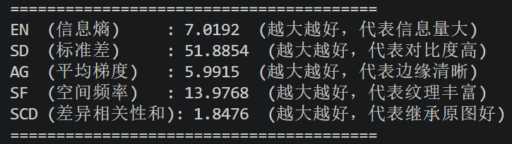
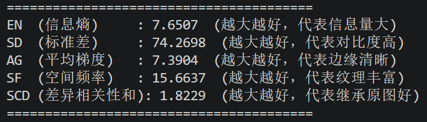

## VIS-IR融合实验（VIF）
### 原论文结果：

### 我的结果：

MSRS：

夜晚01226N.png

白天00262D.png

Roadscene:

如图，在作者提供的模型的基础上，计算所得的融合指标均稍高于论文中所计算得出的数值，模型的性能得以验证

## VIF上的消融实验

严格复现论文中的六个消融实验

### (I)移除内容分支

在model.py中的UNet类中添加如下代码：

    fa = torch.zeros_like(fa)
    fb = torch.zeros_like(fb)
            
### (II)移除语义分支

在model.py中的UNet类中添加如下代码：

    f_f = torch.zeros_like(f_f)

### (III)使用简单的加权平均策略替换APFM

将Diffusion/model.py中的APFM类的输出进行修改。

原始输出：

    out = x * xy_sigmoid + y * (1 - xy_sigmoid)

修改后的输出：

    out = 0.5 * (x + y)

### (IV)使用CNN替换扩散模型作为主干网络

在train.py中修改train类：

删除原有的训练器输入：

    [loss, mse_loss, col_loss, img_mse_loss, exp_loss, ssim_loss, vgg_loss] = trainer(
                gt_imgs, data_concate, e
            )

在该段下添加代码块：

    # 1. 伪造 UNet 需要的 9 通道输入：前 6 通道是条件图，后 3 通道直接给全 0 纯净画布
            dummy_noise = torch.zeros_like(gt_imgs)
            cnn_input = torch.cat([data_concate, dummy_noise], dim=1)
            
            # 2. 伪造时间步 t=0 (CNN 没有扩散步骤，强制当做最后一步输出)
            t_zeros = torch.zeros(gt_imgs.shape[0], device=device).long()
            
            # 3. 直接喂给 UNet，强制它一步吐出最终的融合图像
            pred_imgs = net_model(cnn_input, t_zeros)
            
            # 4. 直接计算预测图和真实图的 MSE 误差作为总 Loss
            loss = F.mse_loss(pred_imgs, gt_imgs)
            
            # 5. 伪造其他分数，防止下方的 TensorBoard 打印代码报错
            mse_loss = loss
            col_loss = torch.tensor(0., device=device)
            img_mse_loss = torch.tensor(0., device=device)
            exp_loss = torch.tensor(0., device=device)
            ssim_loss = torch.tensor(0., device=device)
            vgg_loss = torch.tensor(0., device=device)

绕开原论文所定义的整个训练过程，直接将掩码图输入UNet让其生成融合后的图像。

### (V)仅采用扩散损失Ldiff进行训练

train.py里包含损失的获取，但真正的加权求和是在Diffusion/diffusion.py 里的 GaussianDiffusionTrainer 类的 forward 函数里。

原始代码：

    loss = (mse_loss * mse_loss_weight) + (col_loss * col_loss_weight) + \
               (img_mse_loss * img_mse_loss_weight) + (ssimLoss * ssimLoss_weight) + \
               (vgg_loss * vgg_loss_wight)

修改后的代码：

    loss = mse_loss

### (VI)采用不引入退化的常规掩模策略

将get_data.py中的处理图像块process_blocks函数进行修改。

原始代码：

    def process_blocks(image, pixel_ids, p_ids, deg_ids, pixel):
        """
        处理图像块
        pixel_ids: 要替换为固定像素值的块
        p_ids: 要替换为退化图像对应块的块
        deg_ids: 要替换为退化图像对应块的块（与p_ids类似，但来自不同选择）
        pixel: 固定像素值
        """
        # 处理pixel_ids：替换为固定像素值
        for idx in pixel_ids:
            i, j = idx
            image[
                i * patch_size_row : (i + 1) * patch_size_row,
                j * patch_size_col : (j + 1) * patch_size_col,
                :,
            ] = pixel
        
        # 处理p_ids：替换为退化图像的对应块
        for idx in p_ids:
            i, j = idx
            image[
                i * patch_size_row : (i + 1) * patch_size_row,
                j * patch_size_col : (j + 1) * patch_size_col,
                :,
            ] = deg_choice_img[
                i * patch_size_row : (i + 1) * patch_size_row,
                j * patch_size_col : (j + 1) * patch_size_col,
                :,
            ]
        
        # 处理deg_ids：同样替换为退化图像对应块
        for idx in deg_ids:
            i, j = idx
            image[
                i * patch_size_row : (i + 1) * patch_size_row,
                j * patch_size_col : (j + 1) * patch_size_col,
                :,
            ] = deg_choice_img[
                i * patch_size_row : (i + 1) * patch_size_row,
                j * patch_size_col : (j + 1) * patch_size_col,
                :,
            ]
        return image

修改后的代码：

    def process_blocks(image, pixel_ids, p_ids, deg_ids, pixel):
        # 处理 pixel_ids：替换为固定像素值（保持不变）
        for idx in pixel_ids:
            i, j = idx
            image[
                i * patch_size_row : (i + 1) * patch_size_row,
                j * patch_size_col : (j + 1) * patch_size_col,
                :,
            ] = pixel
        
        # 处理 p_ids：统统替换为纯色 pixel（常规掩模）
        for idx in p_ids:
            i, j = idx
            image[
                i * patch_size_row : (i + 1) * patch_size_row,
                j * patch_size_col : (j + 1) * patch_size_col,
                :,
            ] = pixel 
        
        # 处理 deg_ids：统统替换为纯色 pixel（常规掩模）
        for idx in deg_ids:
            i, j = idx
            image[
                i * patch_size_row : (i + 1) * patch_size_row,
                j * patch_size_col : (j + 1) * patch_size_col,
                :,
            ] = pixel 
            
        return image

## VIF消融实验结果分析

为了节省时间，本实验配置如下：

train:80 val:10 test:91 epoch:100 batchsize:1

消融实验|baseline|I|II|III|IV|V|VI|解释
:-:|:-:|:-:|:-:|:-:|:-:|:-:|:-:|:-:
EN（信息熵）|6.4546|4.7697|7.1232|5.9667|7.6637|6.4380|5.4000|越大越好，代表信息量大
SD（标准差）|49.0886|19.8428|39.9679|41.5442|65.8909|23.4519|45.3314|越大越好，代表对比度高
AG（平均梯度）|8.2924|5.1991|12.3050|5.8750|71.6681|9.4925|5.8217|越大越好，代表边缘清晰
SF（空间频率）|15.3786|11.9955|20.6161|11.7444|116.2376|15.6728|13.4227|越大越好，代表纹理丰富
SCD（差异相关性和）|1.5622|0.2452|1.3444|1.4636|-0.5541|1.0137|1.4021|越大越好，代表继承原图好

